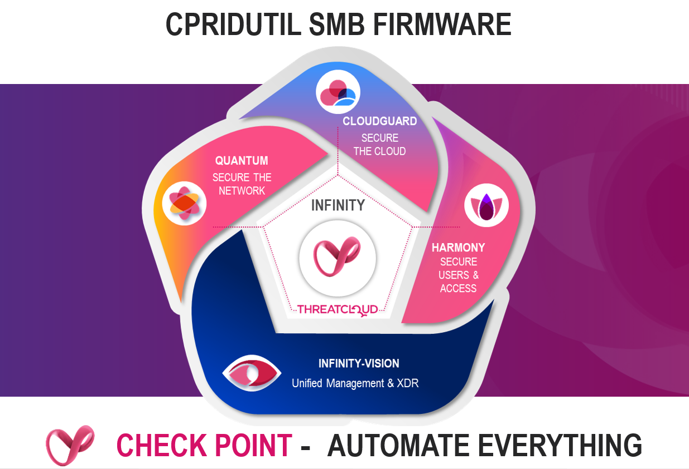

# cp_cpridutil
Get firmware information from CHKP SMB devices through CHKP-MGMT API, including LSM managed.

## Content
`cprid_util.py` - Main Python3 code


## Instructions
#### Clone Repository
Clone the repository with this command:
```
git clone https://github.com/Senas23/cp_cpridutil.git
```
or by clicking on the _‘Download ZIP’_ button and using unzip. <br>

#### cpapi from Check Point Management API Python SDK
Based on the instructions from the CheckPointSW/cp_mgmt_api_python_sdk, download the repository and run `pip install .` or just copy the `cpapi` folder into your root of `cp_cpridutil` folder. Used `cp_mgmt_api_python_sdk` version is v1.12
```
https://github.com/CheckPointSW/cp_mgmt_api_python_sdk/
```

#### Check Point Management API Call Documentation
```
https://sc1.checkpoint.com/documents/latest/APIs/index.html#web/show-gateways-and-servers~v1.8
```

#### Help
```
./cprid_util.py -h

    +-+-+-+-+-+-+-+-+-+-+
    |C|P|r|i|d| |U|t|i|l|
    +-+-+-+-+-+-+-+-+-+-+

    By: The Machine & API Guy & KJ

usage: cprid_util.py [-h] [-u USERNAME] [-p PASSWORD] [-m MANAGEMENT]
                     [--port PORT] [-d DOMAIN] [-o OUTPUTFILE]

optional arguments:
  -h, --help            show this help message and exit
  -u USERNAME, --username USERNAME
  -p PASSWORD, --password PASSWORD
  -m MANAGEMENT, --management MANAGEMENT
  --port PORT
  -d DOMAIN, --domain DOMAIN
  -o OUTPUTFILE, --outputfile OUTPUTFILE
                        Output file
```

### Usage
Execute `cprid_util.py` from the local machine. The execution also works from the CHKP Management server, as all Python3 libs are already present. At the end, you will get per default `output.csv` file.

#### Set user execute permission
Run:
```
chmod u+x cprid_util.py
```

#### Execute
Run:
```
./cprid_util.py -u admin -p SuperSecretPassword123! -m 10.0.0.10 -o output.csv
```

#### CSV Sample Output
```
GW,Image,Serial,MAC,IP,Status
SMB-1500-GW,R80_992002665_20_40,XX12X12345,00:1C:DE:AD:BE:EF,172.16.10.254,Successful
```


## Development Environment
Python 3.9.5; Ubuntu 18.04.5 LTS; VS Code; CHKP SMS R81.10 with MGMT API v1.8
